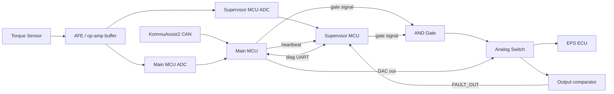

# Firmware Architecture

For the full end-to-end behavior with diagrams (block, flowchart, state), see [Complete Signal Flow](complete-flow.md). This page covers the code structure and the decisions behind it.

## Block diagram

## Three-target structure

The firmware is split across three compilation targets:

| Target | Files | Purpose |
|---|---|---|
| Shared | `fault_codes.h/.c`, `shared_protocol.h/.c` | Fault code definitions and UART protocol shared by both MCUs |
| Main MCU | `main_mcu.h/.c` | CAN-facing, owns the 5-state machine, drives DAC output |
| Supervisor MCU | `main_supervisor.h/.c` | Drives its half of the gate approval via `SUPERVISOR_GATE_ENABLE`, independent monitoring |

Details on each target: [Main MCU](main-mcu.md) · [Supervisor MCU](supervisor-mcu.md) · [Shared Files](shared-files.md)

## Core architectural decisions

These are confirmed and should not be revisited without good reason:

- **Direct register writes throughout — no HAL.** Chosen for safety traceability: every register access is explicit and auditable. No CubeMX, no CMSIS headers.
- **SysTick-based fixed-period timing on both chips.** Guarantees debounce and timeout cycles run on a predictable period, independent of main-loop jitter.
- **Boost threshold applies to the CAN value field, not raw ADC.** Entry when CAN value > 200, exit below 185 (hysteresis band to prevent chattering at the threshold).
- **Two-bucket fault recovery policy:**
  - *Transient/environmental faults* — auto-recover once the condition clears
  - *Compute-integrity faults* — one retry allowed per drive cycle; recurrence within the same drive cycle escalates to requiring an ignition cycle before further retry
- **Neither chip can unilaterally engage boost.** The main MCU drives `MCU_GATE_ENABLE` and the supervisor drives `SUPERVISOR_GATE_ENABLE`; a hardware AND gate requires both HIGH. Despite owning the state machine, the main MCU does not have the final word on whether boost/pass-through is engaged — the supervisor's independent approval is equally required. See [Key Learnings](../key-learnings/README.md#supervisor-holds-veto-is-correct-for-asil-b) for the safety rationale.
- **`FAULT_OUT` is a hardware input**, generated by the LM393 comparator on the board — not something firmware computes or asserts.

## No-HAL / register-level approach

Because CubeMX and CMSIS headers were unavailable for this setup, a hand-written minimal register definition header (`reg_defs.h`) was created — covering **only** the GPIO and RCC peripherals actually used, deliberately kept minimal rather than a full peripheral header.

**This approach already caught one real bug**: an invented RCC register (`CRRCR`) was shifting the offset of `IOPENR` incorrectly. It was found and corrected against RM0454 Table 28 before anything was flashed to hardware. This is the reason for the standing rule below.

> **Rule: never invent a register or offset.** Every register and offset used in `reg_defs.h` must be verified against RM0454 before use — not assumed from memory, not assumed from another chip's layout.

## Why direct register access instead of HAL

For a safety-rated design, every register write needs to be traceable and auditable against the reference manual. HAL abstracts this away in ways that make it harder to reason about exactly what's happening at the hardware level during a safety review. The tradeoff is more manual work and more surface area for bugs like the `CRRCR` one above — which is exactly why register-level review against RM0454 is non-negotiable before flashing.
