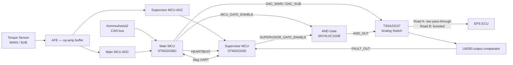
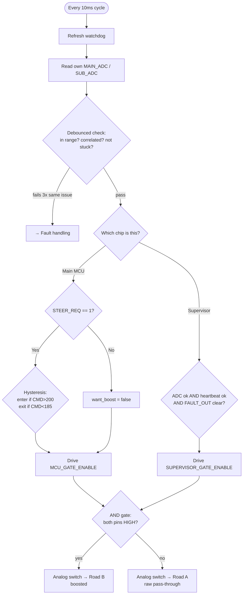
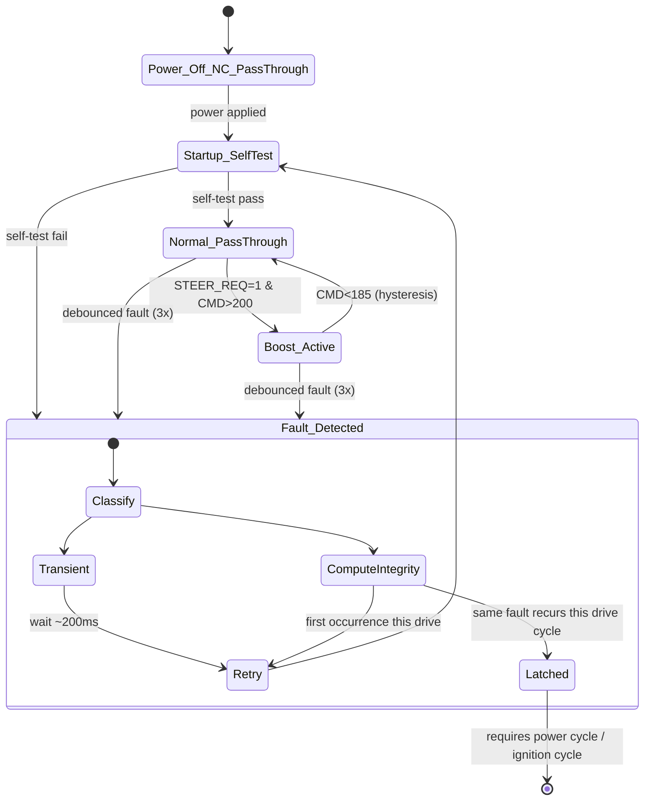

# Complete Signal Flow

This is the full picture of what the firmware actually does, cycle by cycle, on both chips — self-test, the always-on monitoring layer, the boost decision, where the two chips' decisions physically meet, and fault recovery. Other firmware pages ([State Machine](state-machine.md), [Fault Handling](fault-handling.md)) cover the same ground per-topic; this page is the version that ties it all together in one place.

> **Complete ≠ finished.** This describes what the current code does, end to end. It is not a validated, ready-to-ship system — see the ⚠️ flags below and [Open Items](../open-items/) for everything still a placeholder or pending Ting's sign-off.

## Block Diagram

High-level signal and control path. Pin names below the diagram are as described in this flow — see the **pin naming note** at the end of this page before treating them as final.



## Power-on (both chips, independently)

The 5V rail powers both chips at once, but each boots and runs its own init independently — there's no "leader" at boot.

```
EPS 5V rail powers up → both chips boot
Each chip's own init routine:
    - checks: did I just come back from a watchdog reset? (remembered, reported later)
    - starts its own peripherals (ADC, UART, and CAN on the main MCU only)
    - forces its OWN gate pin LOW immediately, before anything else runs
```

That last line matters: even before self-test runs, both gate pins default low, so the AND gate can't accidentally pass boost during the boot window.

## Main MCU startup self-test

One raw (non-debounced) check, run once at boot, before entering normal operation:

```
MAIN_ADC / SUB_ADC in range? correlated? not stuck?
    FAIL → Fault state immediately
    PASS → Normal pass-through
```

## The "always watching" layer — runs every cycle, forever, on both chips independently

**Main MCU, every 10ms:**

* Refresh watchdog (miss this and the chip auto-resets)
* Toggle the heartbeat pin every 50ms
* Read its own MAIN\_ADC / SUB\_ADC
* Debounced check — in range, correlated, not stuck (one bad sample is forgiven; the _same_ problem 3 cycles in a row is treated as real)
* Poll CAN for the steering-LKAS message, decode `STEER_REQ` (1 bit) and `STEER_CMD` (11 bits) ⚠️ _still needs verification against a real CAN frame_
* Send/receive diagnostic UART frames (informational only right now)

**Supervisor, every 10ms:**

* Refresh watchdog
* Read its **own**, physically separate ADC taps on MAIN/SUB
* Same kind of debounced check, computed completely independently of the main MCU
* Read the main MCU's heartbeat pin — still toggling?
* Read `FAULT_OUT` — has the LM393 comparator flagged the actual output voltage as wrong?
* Send/receive diagnostic UART frames (informational only)

The two chips never share a single ADC reading or a single "is it healthy" verdict — each computes its own answer from its own hardware.

## The boost decision — main MCU

```
if STEER_REQ == 0:
    want_boost = false        (STEER_CMD is ignored entirely)
else:
    not currently boosting → need STEER_CMD > 200 to start
    already boosting        → only drop out if STEER_CMD < 185
                               (hysteresis, prevents flicker right at the edge)

Drive MCU_GATE_ENABLE = want_boost, every cycle, directly
```

## The boost decision — supervisor

```
approve = own_ADC_checks_pass AND heartbeat_ok AND !FAULT_OUT_asserted

Drive SUPERVISOR_GATE_ENABLE = approve, every cycle, directly
```

## Where the two decisions meet — pure hardware, no software involved

```
MCU_GATE_ENABLE AND SUPERVISOR_GATE_ENABLE → AND gate output
    HIGH + HIGH → analog switch: Road B (boosted)
    anything else → analog switch: Road A (raw pass-through —
                     same position it defaults to on total power loss)
```

Neither chip can force boost on its own. This is the two-key mechanism described in [Safety Architecture](../hardware/safety-architecture.md).

## If boosting — DAC output ⚠️ formula still a placeholder

```
dac_main = main_adc + BOOST_OFFSET_COUNTS   (currently guessed at 30, unvalidated)
dac_sub  = 4095 − dac_main                  (derived, keeps MAIN+SUB invariant)
    clamped to 0–4095 (12-bit DAC range)
→ written to DAC_MAIN / DAC_SUB
```

See [Open Items — boost amount formula](../open-items/#boost-amount-formula).

## Fault handling — main MCU (has a recovery policy; supervisor doesn't)

The main MCU is the only chip that currently _remembers_ fault history across cycles:

```
Any debounced check fails →
    force MCU_GATE_ENABLE LOW immediately
    classify: transient (e.g. CAN timeout, stale UART link)
           or compute-integrity (heartbeat lost, watchdog reset,
              output mismatch, + 7 others still defaulted to this
              stricter bucket pending Ting's FMEDA sign-off)

    transient                            → wait ~200ms → retry self-test
    compute-integrity, first this drive  → same, one retry allowed
    compute-integrity, same fault again
        within this drive cycle          → LATCHED — stays in fault/pass-through
                                            until the chip loses power and reboots
                                            (i.e. next ignition cycle)
```

## Fault handling — supervisor (simpler: re-evaluated fresh every cycle, nothing to get stuck in)

```
Any check fails this cycle → force SUPERVISOR_GATE_ENABLE LOW this cycle
Next cycle → re-evaluate completely fresh, no memory of the previous failure
    (exception: if this cycle's fault was a watchdog reset, it's reported
     once, right after the reset, purely for visibility)
```

This asymmetry is intentional for now, but it's also a known gap — see [Fault Handling — known gaps](fault-handling.md#known-gaps-in-fault-coverage) on supervisor-side recovery-latch enforcement not yet existing.

## The deepest fallback — doesn't depend on any of the above

```
If either chip loses power entirely, crashes beyond watchdog recovery,
or the whole board loses power:
    both gate pins go to their natural unpowered state (LOW)
    the analog switch's own hardware default is ALSO Road A
    → raw sensor signal reaches the ECU regardless of any firmware
      state, any chip being alive, or any logic being correct
```

## Flowchart — one cycle, both chips



## State diagram — main MCU, including fault sub-states



## Pin naming — now confirmed

The pin names used in this page (`MCU_GATE_ENABLE`, `SUPERVISOR_GATE_ENABLE`, `HEARTBEAT`, `FAULT_OUT`) are now confirmed against `Schematic_Torque-Interceptor_2026-08-17.png` and match [Main MCU](main-mcu.md) and [Supervisor MCU](supervisor-mcu.md). This was previously flagged as an open discrepancy against an older pin table (which had `FORCE_PT`/`GATE_ENABLE` both on the supervisor, `HEARTBEAT_OUT` on `PC6`, etc.) — that older table has now been corrected throughout this book. See [Open Items](../open-items/#pin-table-corrected-against-2026-08-17-schematic) for the full before/after list, and note that a couple of exact pin numbers (`MCU_GATE_ENABLE`'s `PB7`, `SWDCLK`'s `PA14`) are still marked ⚠️ as not fully legible on the source image — worth a quick EasyEDA check before wiring against them.
