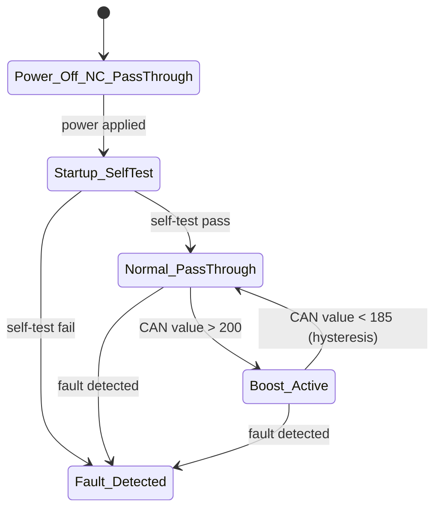

# State Machine

The main MCU owns a 5-state state machine. For the full cycle-by-cycle behavior on both chips (self-test, debounce, hysteresis, watchdog, fault recovery), see [Complete Signal Flow](complete-flow.md) — this page is the state-machine-only summary.

## Startup self-test

On power-up, before any active operation, the main MCU runs one **raw (non-debounced)** check: is `MAIN_ADC`/`SUB_ADC` in range, correlated, and not stuck? Fail → straight to `Fault_Detected`. Pass → `Normal_PassThrough`. This is a single pass/fail check, distinct from the continuous *debounced* monitoring described below and in [Complete Signal Flow](complete-flow.md#the-always-watching-layer--runs-every-cycle-forever-on-both-chips-independently).

## State descriptions

| State | Description |
|---|---|
| `Power_Off_NC_PassThrough` | Hardware default. The NC analog switch provides pass-through purely from being unpowered — no firmware involvement. This is the state the board is in before any MCU has even booted. |
| `Startup_SelfTest` | Entered on power-up. Runs self-test routines before allowing any active operation. |
| `Normal_PassThrough` | Firmware-managed pass-through. Torque sensor signal passes to the ECU, monitored but not modified. |
| `Boost_Active` | Boost engaged — DAC output modifies the signal per the boost formula (see [Open Items](../open-items/README.md#boost-amount-formula) — this is not yet finalized). |
| `Fault_Detected` | Entered from any state when a fault is detected. Recovery behavior depends on fault classification — see [Fault Handling](fault-handling.md). |

## Boost entry/exit thresholds

Boost activation is gated on the **CAN value field**, not the raw ADC reading:

- **Entry:** CAN value > 200 → transition to `Boost_Active`
- **Exit:** CAN value < 185 → transition back to `Normal_PassThrough`

The gap between 185 and 200 is a deliberate hysteresis band, preventing state chatter if the CAN value sits near a single threshold.

## Why input validation is always-on, but boost computation is gated

Input validation and monitoring (ADC range checks, stuck-value checks, etc.) run continuously regardless of state. Boost *computation* only engages once CAN value > 200. This is a deliberate split between the **safety monitoring** function (always active) and the **ADAS function** (only active when commanded and within valid conditions) — see [Key Learnings](../key-learnings/README.md) for why this split matters.
