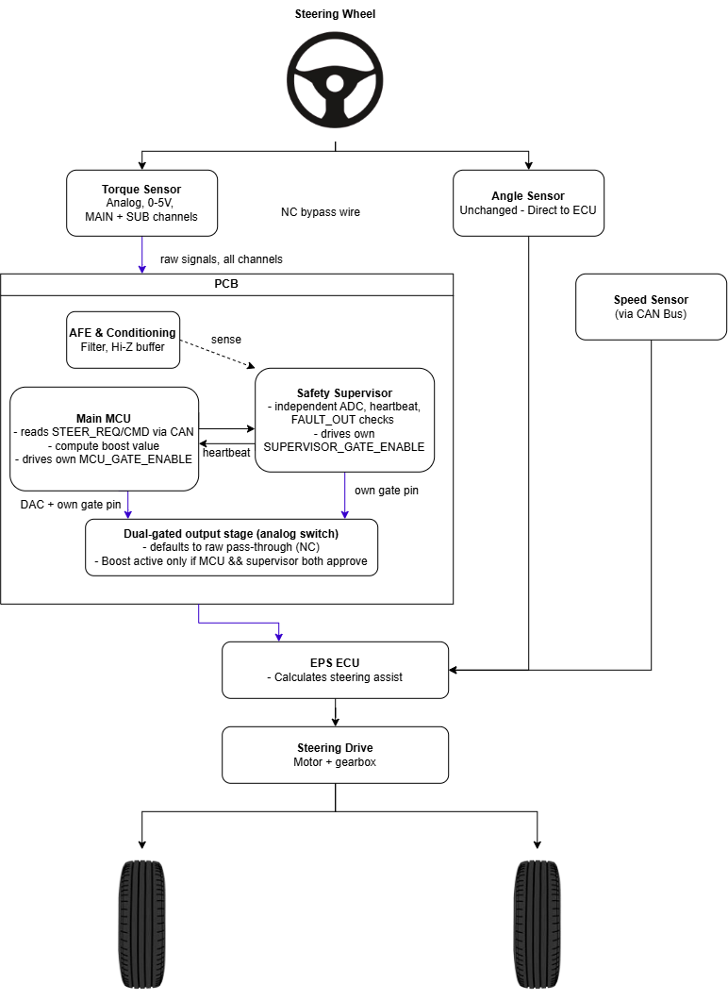

# Project Overview

## Context

Kommu is a Malaysian ADAS company building KommuAssist2, a fork of openpilot/bukapilot. The torque interceptor is a safety-rated PCB that enables KommuAssist2 to actively boost steering assist on Perodua vehicles.

## What problem it solves

Perodua's EPS system has its own torque sensor and ECU. To let KommuAssist2 influence steering assist, something needs to sit between the torque sensor and the ECU and be able to:

- Pass the torque sensor signal through unmodified during normal operation
- Boost the signal on command from KommuAssist2 over CAN, when appropriate
- Guarantee it never gets "stuck" boosting or feeding a corrupted signal, with hardware-level guarantees, not just firmware

## Target safety level

**ASIL B** per ISO 26262. This shapes almost every design decision in the project:

- Dual-MCU architecture (main + supervisor) so no single point of software failure has final authority
- Hardware fail-safe (NC analog switch) as the ultimate backstop, independent of firmware being alive
- Fault classification and recovery policy justified against the ASIL B latent fault detection metric (≥60%), not just "best practice"

## Timeline

Roughly a two-month prototype timeline, targeting JLCPCB fabrication and PCBA assembly. Hardware phase is complete; the project is now in firmware development.

## High-level architecture

This shows where the Torque Interceptor PCB sits in the overall steering system. The torque sensor's MAIN and SUB signals pass through the board before reaching the EPS ECU, while the angle sensor and speed sensor are untouched, they go straight to the ECU. Inside the PCB, the main MCU and safety supervisor each independently tap the sensor signal, each compute their own verdict, and each drive their own gate pin into a shared output stage. Boost only reaches the ECU if both agree. This fail-safe covers the MCUs crashing while the board has power, not the board losing power entirely, that scenario is a separate, unresolved gap, see [Validation Requirements](../open-items/README.md#critical-total-power-loss-is-not-currently-covered-by-any-fail-safe).

Two MCUs on the board:

| MCU | Part | Role |
|---|---|---|
| Main MCU | STM32G0B1CBT6 | CAN-facing, owns the state machine, drives the DAC output, drives its own gate signal |
| Supervisor MCU | STM32G030F6P6TR | Independent monitoring, drives its own gate signal |

Key idea: the busier, CAN-facing chip (main MCU) does not hold sole safety authority. Each chip independently computes its own verdict and drives its own gate pin (`MCU_GATE_ENABLE`, `SUPERVISOR_GATE_ENABLE`) into a shared AND gate; boost only reaches the output stage if both agree. This is stronger than one chip holding veto over both signals, a bug in either chip's own logic alone is no longer enough to cause an unsafe outcome. See [Firmware Architecture](../firmware/architecture.md) and [Key Learnings](../key-learnings/README.md) for the full reasoning.

On top of that, a hardware-level analog switch defaults to pass-through when the MCUs' control signals are absent, this covers MCU or firmware failure while the board still has power. It does not cover total loss of board power, that scenario currently results in no signal reaching the ECU at all, not a safe pass-through. This is a real, unresolved gap in the design, see [Validation Requirements](../open-items/README.md#critical-total-power-loss-is-not-currently-covered-by-any-fail-safe) for detail before treating the power-loss story as settled.
